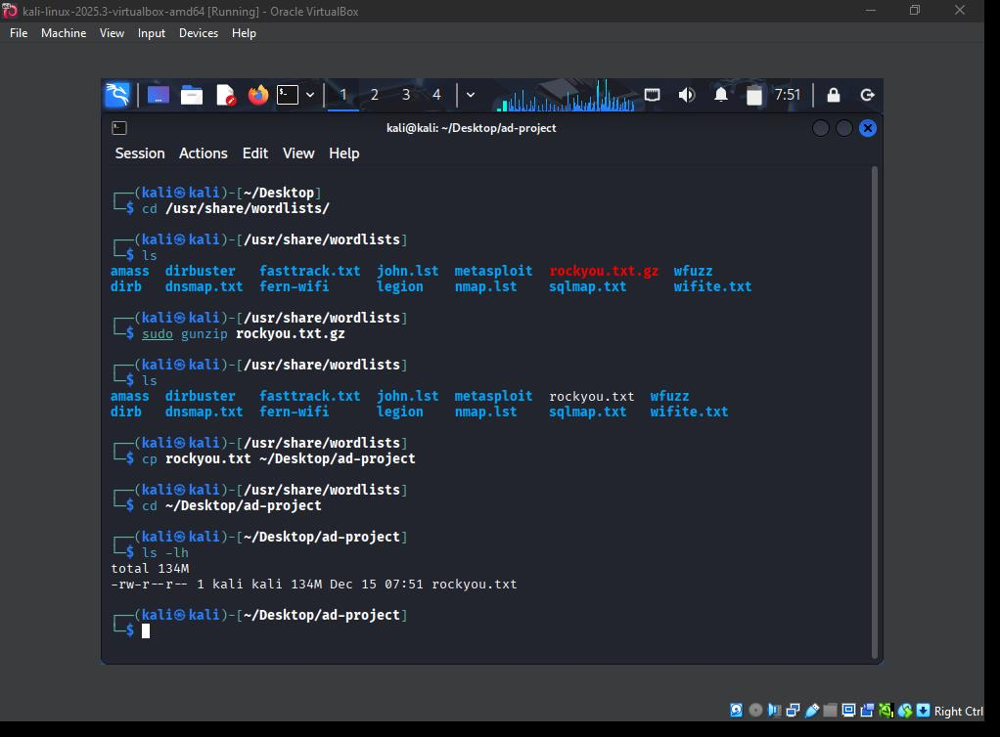
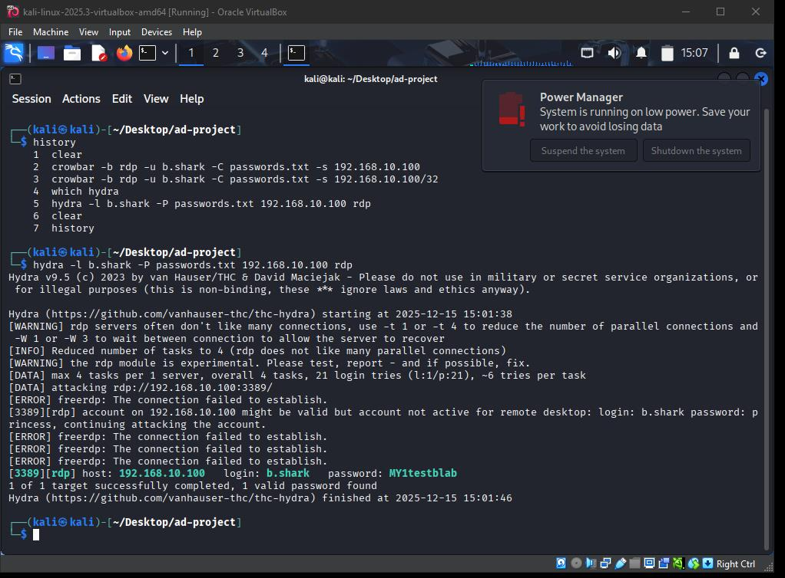
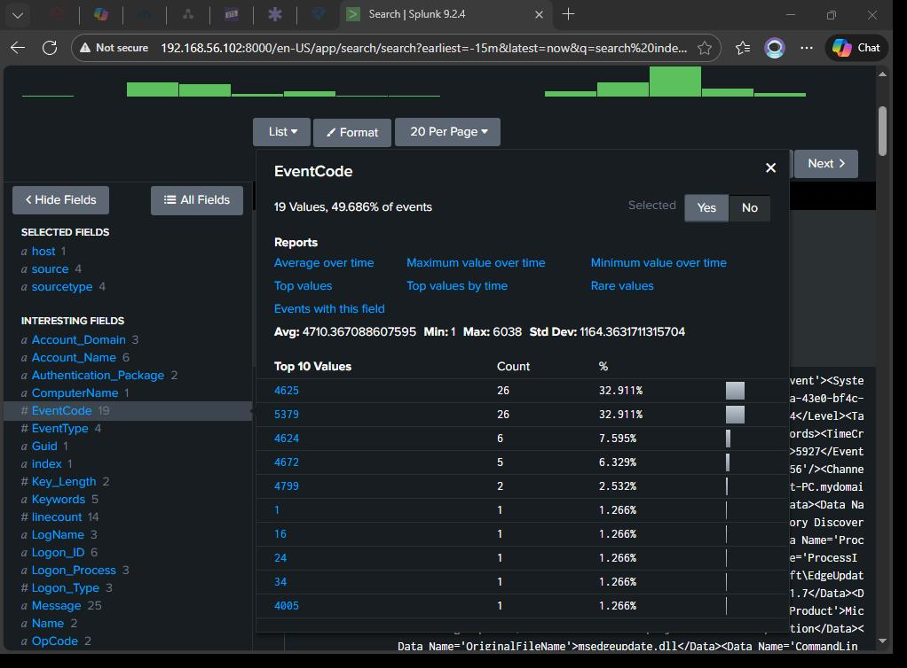

# 3. Validation Methodology.

## 3.1 Why Brute Force?
To validate the end-to-end functionality of this lab, a `Remote Desktop Protocol (RDP)` Brute-Force Attack was selected as the testing mechanism. This method was chosen because it simultaneously tests multiple layers of the deployment:

* Connectivity: Confirms that the attacker can reach the Target-PC via the network.

* RDP Availability: Ensures the RDP service is correctly configured and listening for external requests.

* Telemetry Generation: Forces the generation of high-volume logs, providing the necessary data to test the Splunk ingestion pipeline.

## 3.2 Execution
Once connectivity and tool paths were verified, the brute-force attack was initiated to generate the necessary security telemetry.

### A. Hydra 
[Hydra](https://www.kali.org/tools/hydra/) is a parallelized login cracker which supports numerous protocols to attack. It is very fast and flexible, making it possible for researchers and security consultants to show how easy it would be to gain unauthorized access to a system remotely. 
 

* In order to carry out the attack,a popular wordlist that comes with kali linux was used. It is named `rockyou.txt.gz` found under `usr/share/wordlists/`. A project folder `ad-project` was created and file was copied into it.

* After extracting the contents of the `rockyou.txt.gz` file, a subset of the wordlist was isolated and written to a separate file, `passwords.txt` for use in the brute-force attack due to the original file’s size.

* The attack targeted the RDP service on the Target-PC using the curated password list to simulate a credential-stuffing attempt against the `b.shark` account. 

The following command was used to achieve this objective: 
`hydra -l b.shark -P /home/kali/Desktop/passwords.txt 192.168.10.100 rdp -V`

* -l: Targeted the specific Active Directory user.
* -P: Pointed to the password wordlist.
* -V: Enabled verbose output to monitor the connection status in real-time.
 

The experiment successfully identified the target account and password, confirming the effectiveness of the approach
 

### B. Telemetry
On the Target-PC, each failed attempt by Hydra was expected to trigger a Windows Security Event ID 4625 (An account failed to log on). This event is critical for validation because it captures:
* Logon Type 10: Specifically identifying a Remote Desktop attempt.
* Source Network Address: The IP address of the Kali Linux attacker.
* Target Account: The username being targeted `b.shark`.

## 3.3 Splunk Ingestion.
The final step of the validation phase was confirming that these Windows events were successfully forwarded and indexed by Splunk.

### A. Validation Query
The following Splunk Search Processing Language (SPL) query was used to isolate the attack traffic:

`index="main" sourcetype="WinEventLog:Security" EventCode=4625
| table _time, Target_Account, Source_Network_Address, Status`

### B. Result
The appearance of these logs in the Splunk Search Head confirmed that the Data Pipeline was functional:
* Windows Security Log recorded the failure.
* Splunk Universal Forwarder monitored and sent the log.
* Splunk Indexer received and parsed the data.

In Splunk, 26 instances of Windows Security `Event ID 4625` were observed, corresponding to failed authentication attempts generated during the experiment. 
These events confirm repeated invalid credential submissions prior to `successful account compromise`.
