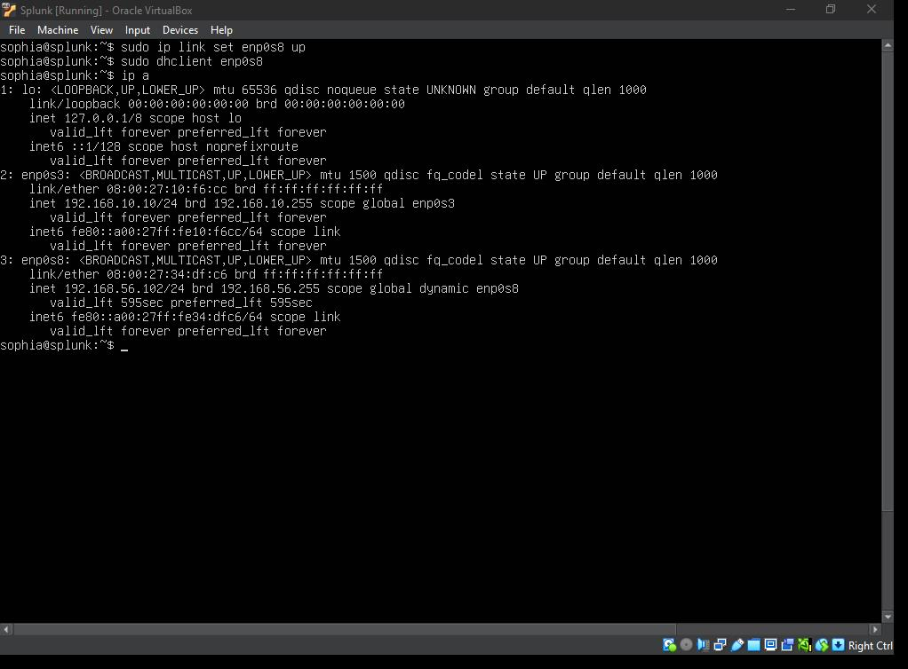
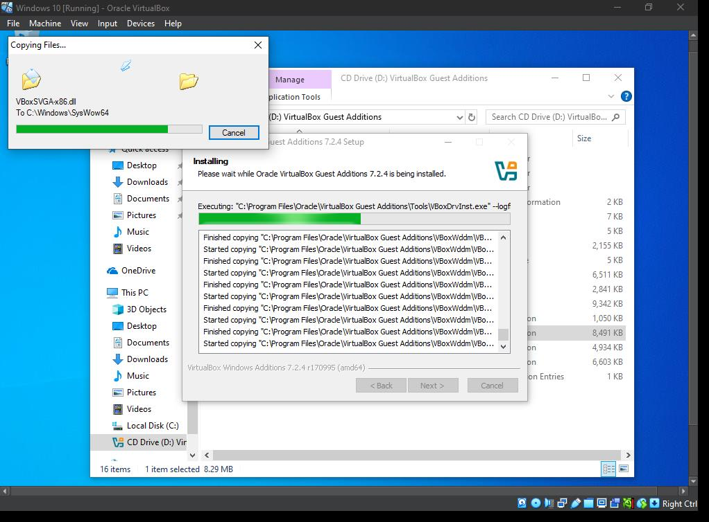

# 4. Technical Troubleshooting
During the deployment and validation phases, several critical blockers were encountered across the various platforms.
This section details those issues and the steps taken to resolve them.

## 4.2 Splunk Server Access
* After successfully setting up the Splunk server, all efforts to access the web interface proved futile.

* Root Cause: The Splunk Server was initially configured on the NAT network which caused an isolation of the guest OS from the physical host.

* Resolution: A host-Only adapter was added and enabled using `dhcp client`. This served as a secondary network interface to the Splunk server.

 
To link - `sudo ip link set enp0s8 up` 
Request IP - `sudo dhclinet enp0s8`
  

## 4.1 The "SID" Error
* During the brute force attempt, Hydra returned an error: `account might be valid but account not active for remote desktop`, even though the user `b.shark` was correctly added to the Remote Desktop Users group.

* Root Cause: A fundamental DNS misconfiguration on the Target-PC. Because the Target machine's primary DNS was pointing to an external gateway rather than the Domain Controller, it could not resolve Security Identifiers (SIDs) to Domain names. This caused the RDP service to fail the authorisation check because it couldn't verify the group membership of the user.

* Resolution: The Network Adapter settings on the Target-PC were updated to point to the Domain Controller's IP `192.168.10.10` and a reregistration was forced in `powershell` using the following commands:
  `ipconfig /flushdns` 
  `ipconfig /registerdns`

## 4.3 Splunk Ingestion Latency
* In the Splunk Web Interface, security logs were appearing with significant lag or not at all, accompanied by "Ingestion Latency" warnings. 

* Root Cause: The default throughput limit of 256 KBps was insufficient for the burst of security events generated by the attack.
  
* Resolution: The Indexer's configuration was manually edited to remove the throttle. 
File Path: `/opt/splunk/etc/system/local/limits.conf` 
Configuration: 
`[thruput]
maxKBps = 0`

## 4.4 Shared Folder Integration
* The Splunk Universal Forwarder `.msi` needed to be installed on the Target-PC and Domain Controller for the telemetry pipeline setup but due to ignificant performance lag, downloads were not feasible. 

To resolve this, the following steps were taken:
* I navigated to the optical drive `Z://...`  and manually installed the `VBoxWindowsAdditions-amd64.exe` as an Administarator on both machines.

 
* Once Guest Additions were manually installed, the VMs was rebooted.
* A shared folder was set-up on both machines to host the Splunk Universal Forwarder installer, which was then accessed through the file explorer and successfully installed.
