# 2. Environment Architecture and Deployment

This section details the physical configuration and network topology of the lab environment, establishing the foundation for all subsequent validation activities.

## 2.1 Virtualised Architecture Overview

The lab was deployed using VirtualBox on an isolated network segment. This ensured that all components communicated exclusively within the lab environment, simulating an internal enterprise network.

* **Domain Name:** Mydomain
* **Network Scheme:** 192.168.10.0/24 
* **DNS Resolution:** The Target-PC was configured to use the Windows Server (DC) as the primary DNS resolver.

NOTE - I used a different name when creating the domain on Active directory, hence the difference from what is visible in the Logical diagram.

## 2.2 Component Deployment Breakdown

The four virtual machines and their specific roles were configured as follows:

### A. Target-PC
* **OS:** Windows 10 
* **IP Address:** 192.168.10.x
* **Role:** Served as the primary **RDP Target** for the brute-force simulation.
  
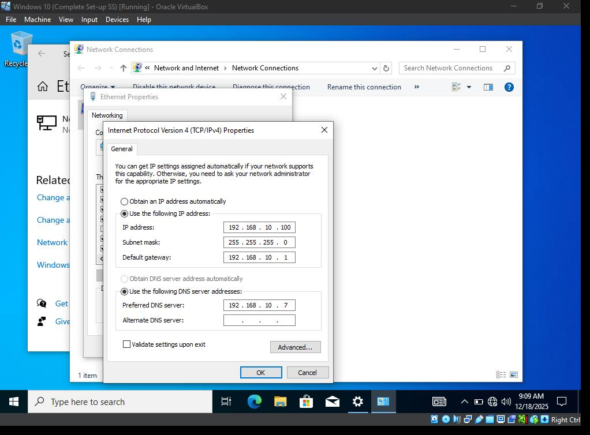
Configured the Target-PC IP settings to match the local network information.
  

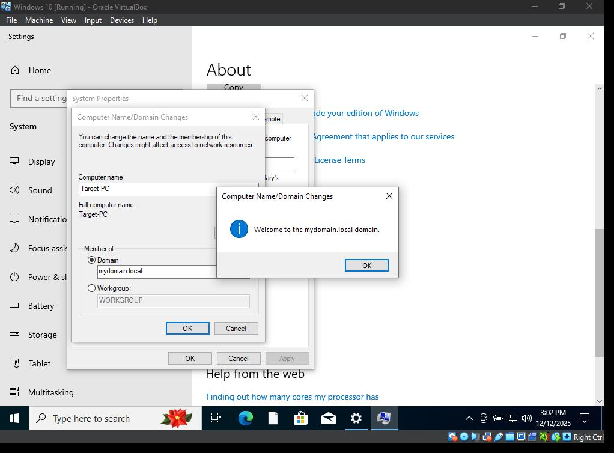
Added the Target-PC to `mydomain`
  

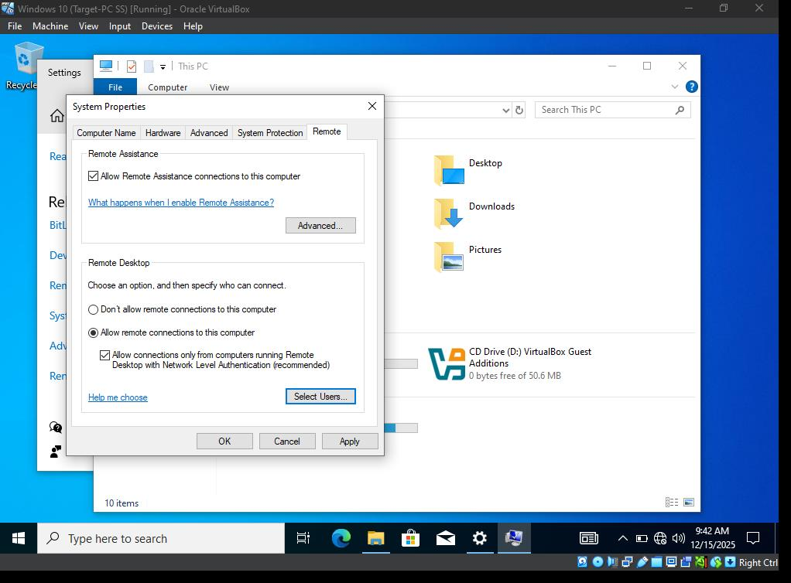
Enabled RDP on the Target-PC
  

### B. ADDC01
* **OS:** Windows Server 2019
* **IP Address:** 192.168.10.7
* **Function:** Served as the Active Directory Domain Controller and the primary DNS resolver. The user `b.shark` was created here for testing.

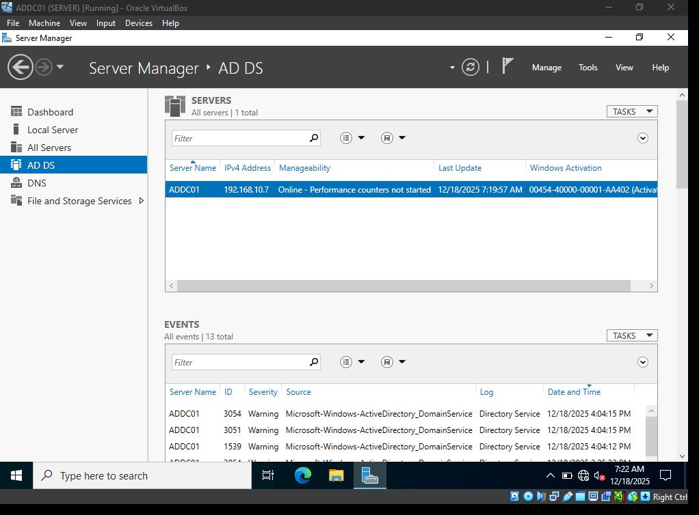
Installed Active Directory and promoted it to a Domain COntroller (DC)
 

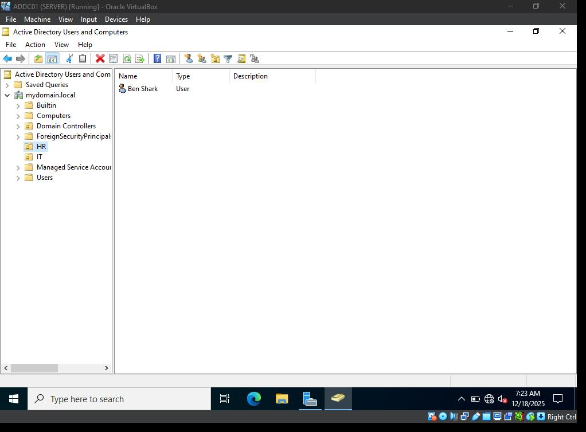
Created Users in `mydomain`

### C. Attacker Platform
* **OS:** Kali Linux 
* **IP Address:** 192.168.10.250
* **Fuction:** Used for executing the brute-force attack via **Hydra**.
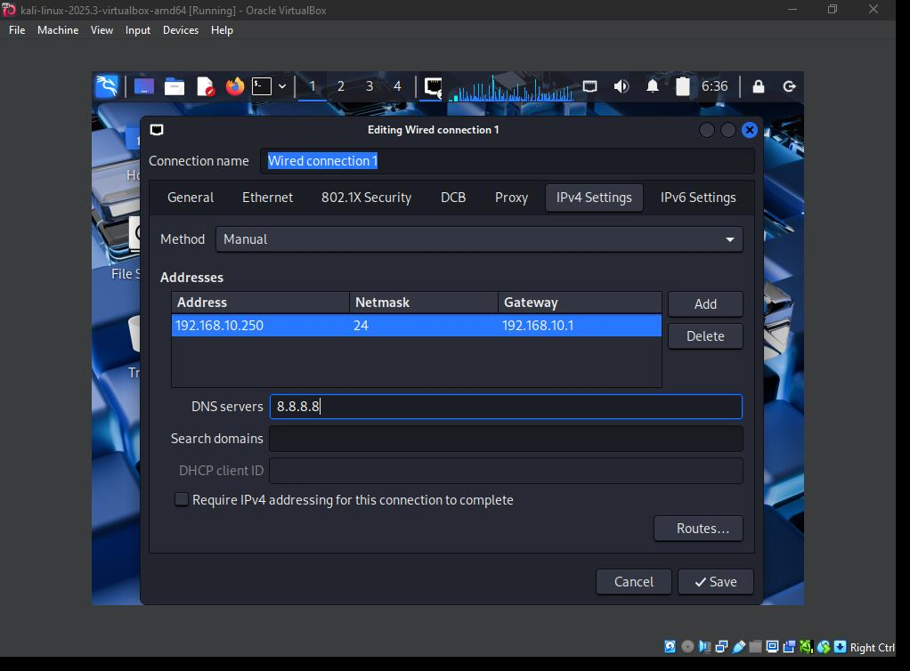
 

### D. Splunk SIEM
* **OS:** Ubuntu Server
* **IP Address:** 192.168.10.10
* **Function:** It was the destination for all security telemetry logs, acting as the centralized monitoring system.
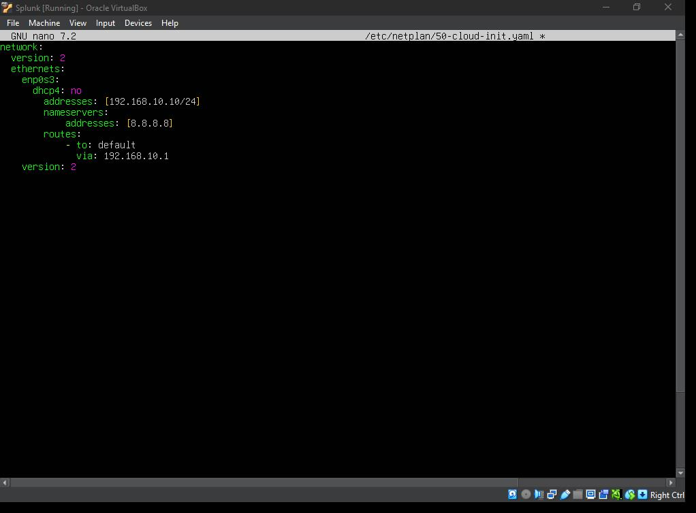
Configured the splunk server to match the network information.
 

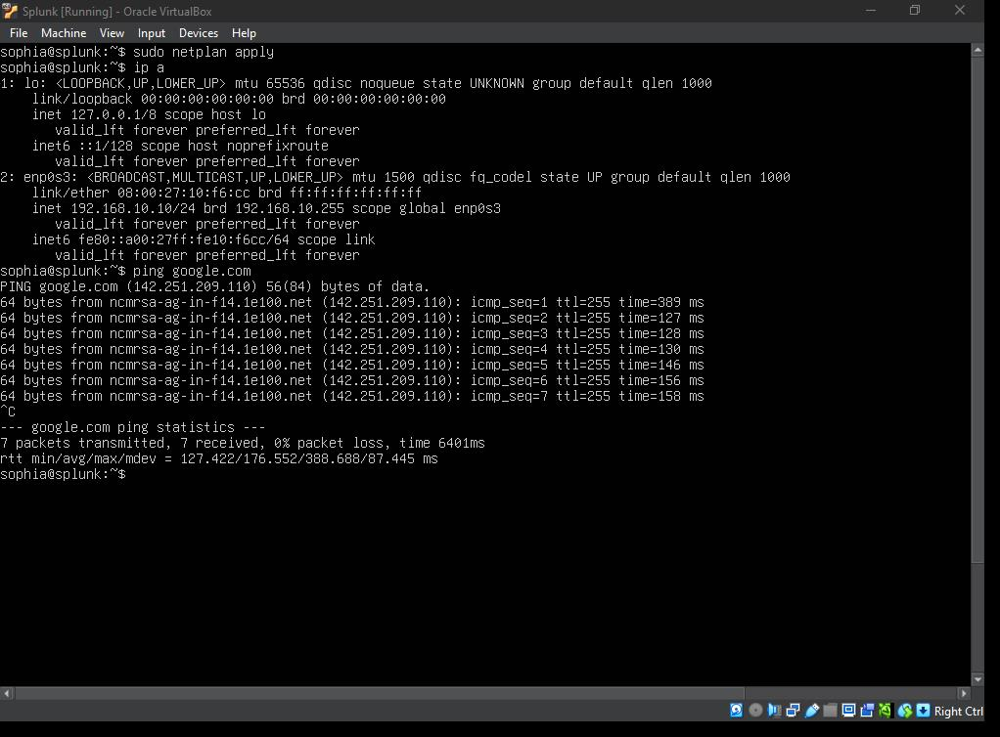
Confirmation of splunk server settings.
 

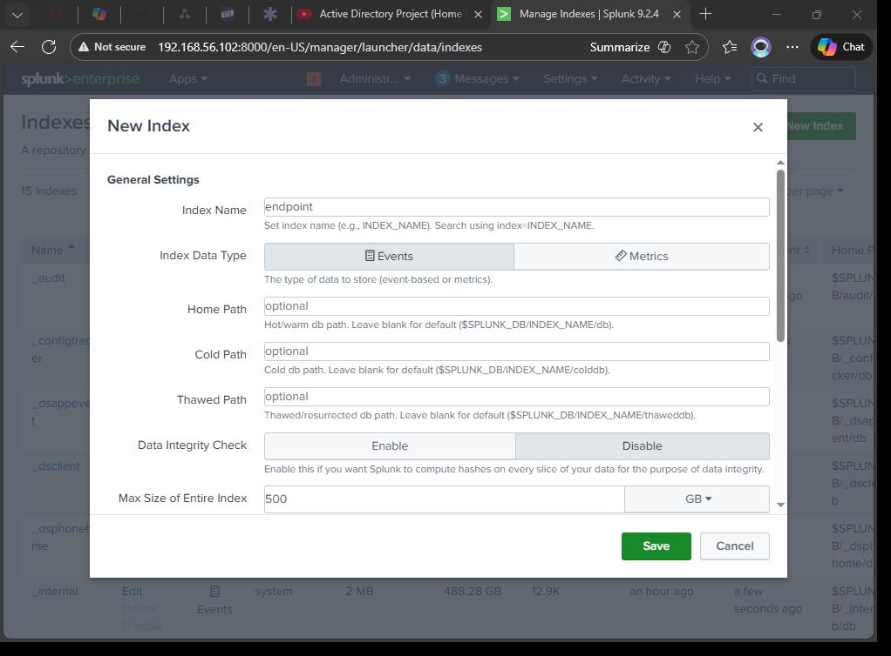
Successfully created an index on the splunk indexer to receive logs from the machines.
 

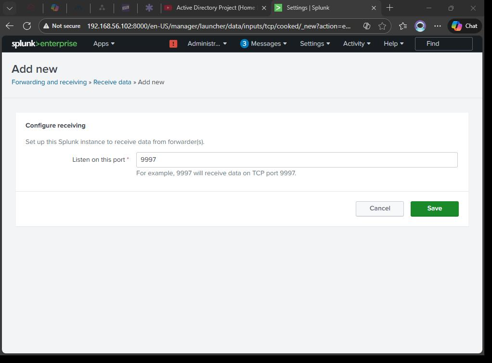
Configured the splunk receiving port as `9997`(default)
 

## 2.3 Splunk Universal Forwarder and Sysmon Configuration

The key link in the detection chain was the Universal Forwarder (UF) installed on both the Target-PC and the Domain Controller.
* **Function:** Configured to monitor the `Security` log channel and stream the data over port `9997` (default) to the Splunk Indexer.

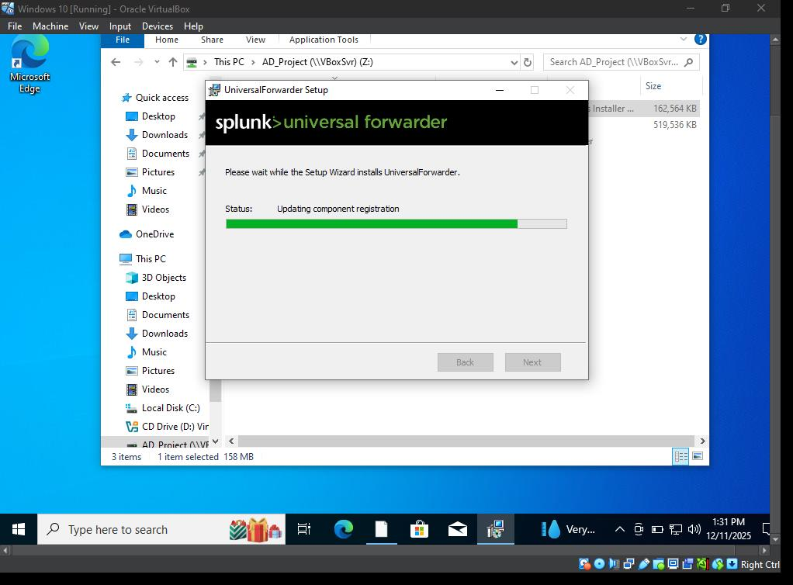
Installed Universal Splunk forwarder on both the Target-PC and Domain Controller.
  

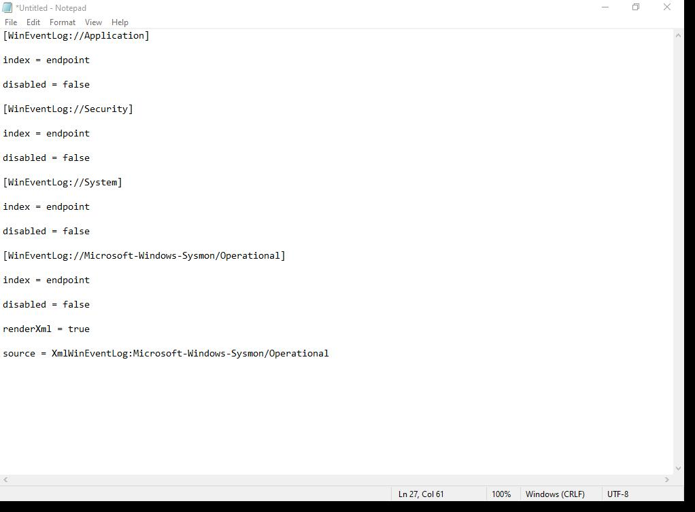
The splunk forwarder was configured to send logs to the `endpoint` index on the Splunk server.
  
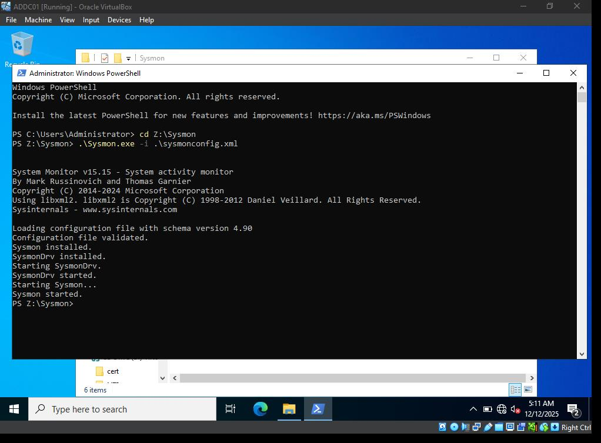
Installed Sysmon on both the Target-PC and the Domain Controller

NOTE - It was essentially the same process on both machines, hence the single snapshots.

After setting up the Splunk forwarder and Sysmon on both the Target-PC and Domain Controller, logs were collected in the Indexer confirming the set-up works.
