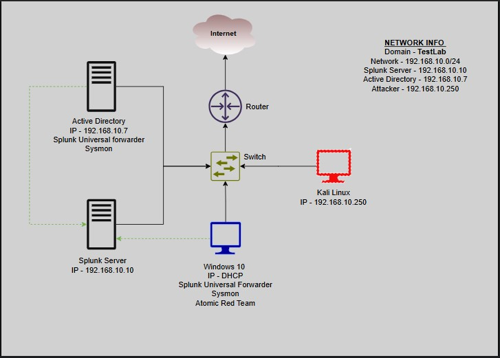

# 2. Environment Architecture and Deployment

This section details the physical configuration and network topology of the lab environment, establishing the foundation for all subsequent validation activities.

## 2.1 Virtualized Architecture Overview

The lab was deployed using VirtualBox on an isolated network segment. This ensured that all components communicated exclusively within the lab environment, simulating an internal enterprise network.

* **Network Scheme:** 192.168.10.0/24 
* **DNS Resolution:** The Target-PC was configured to use the Windows Server (DC) as the primary DNS resolver.

## 2.2 Component Deployment Breakdown

The four virtual machines and their specific roles were configured as follows:

### A. Target-PC
* **OS:** Windows 10 
* **IP Address:** 192.168.10.10
* **Role:** Served as the primary **RDP Target** for the brute-force simulation. The user `b.shark` was created here for testing.

### B. ADDC01
* **OS:** Windows Server 2019
* **IP Address:** 192.168.10.10
* **Function:** Served as the Active Directory Domain Controller and the the primary DNS resolver.

### B. Attacker Platform
* **OS:** Kali Linux 
* **IP Address:** 192.168.10.250
* **Fuction:** Used for executing the brute-force attack via **Hydra**.

### C. Splunk SIEM
* **OS:** Ubuntu Server
* **IP Address:** 192.168.10.30
* **Function:** It was the destination for all security telemetry logs, acting as the centralized monitoring system.

## 2.3 Splunk Universal Forwarder Configuration

The key link in the detection chain was the Universal Forwarder (UF) installed on both the Target-PC and the Domain COntroller.
* **Function:** Configured to monitor the `Security` log channel and stream the data over port 9997 (default) to the Splunk Indexer.
